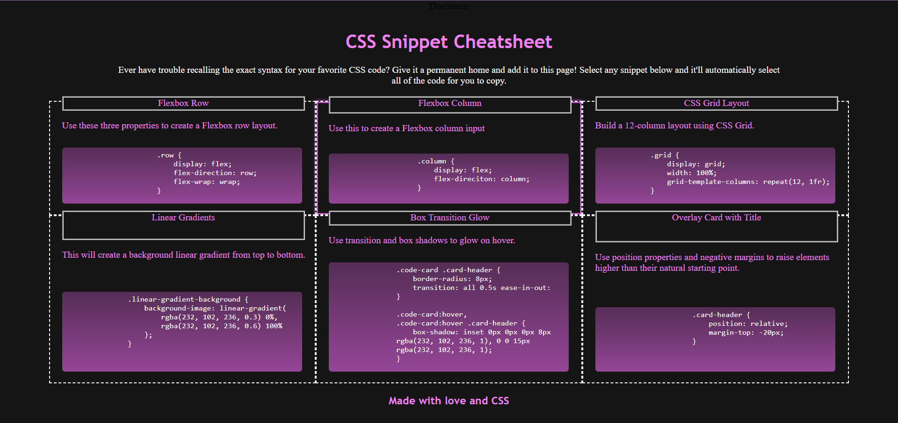
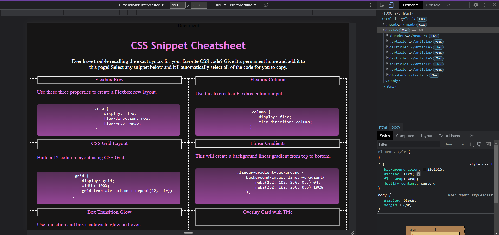
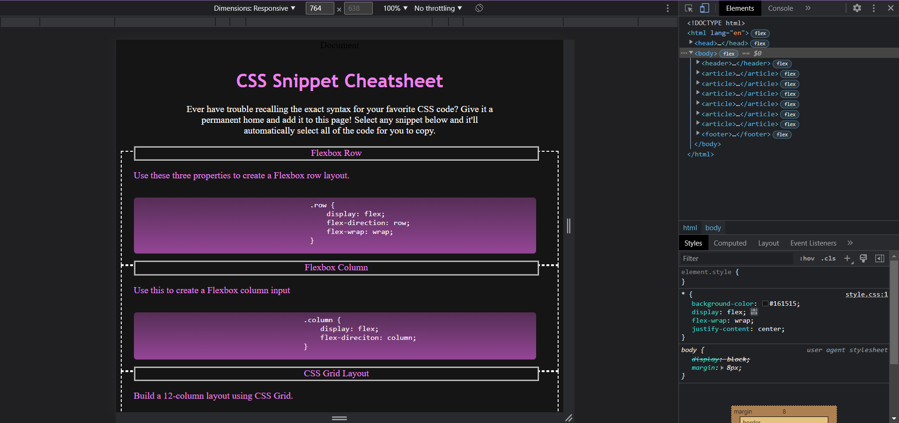

# css-cheat-sheet

<a href="https://pirosvs.github.io/css-cheat-sheet/">Click here to view the site</a>

## Description

This project uses flexboxes to create a responsive site to offer snippets of CSS code for people to use to experiment with things such as gradients, grid layout, and flexbox. Responsive layouts are important so that all functionality can be accessed no matter what device is being used, as some users may not always have access to certain devices or a desktop size screen. This project makes the site legible at smaller sizes instead of getting cut off and not showing content or content getting endlessly smaller or overlapping, which could make the site unusable or impossible to read. This project also relies on collaborative work with a shared repository and handling/ avoiding of merge conflicts, thus demonstrating standards of communication and collaboration with a partner.

Skills used for this project include html and advanced css (not only text color or family but gradients, transitions, flexbox, media queries, psuedo-elements, etc). Additional skills include attention to needs of wide array of users/ devices, semantic html to improve site for screen readers, github and the use of a shared repository, and a gitignore file for collaboration standards, as well as clear communication and collaboration with a partner to create the finished product.

## Credit
Credit to professor and all others involved in the making of the challenge and example site and my partner for this project Daniel Pablo.

## License
This project falls under the MIT license.

## Author
Damien Armstrong can be found on: <a href="https://www.linkedin.com/in/damien-armstrong-412319138/">Linkedin</a>, <a href="https://github.com/pirosvs">Github</a>